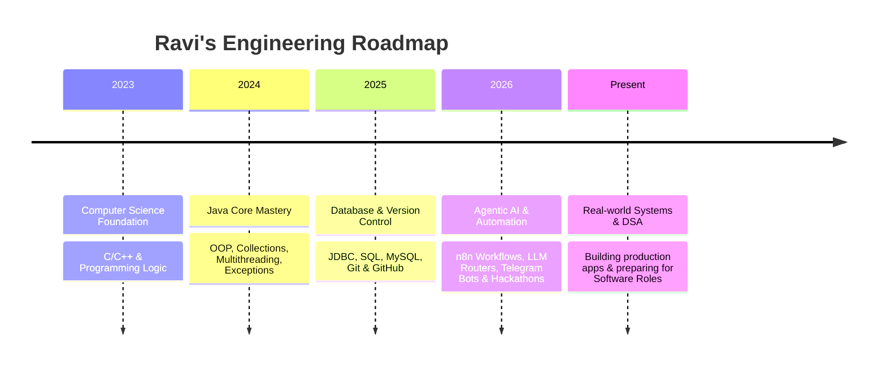

  <h1>Hi there, I'm Ravi Kumar Gangwar 👋</h1>
  <h3>Java & AI Automation Engineer | CSE Student</h3>

  

    Building reliable Java backend systems, engineering Agentic AI workflows with <b>n8n</b>, and solving complex real-world problems through clean code and automation.
  

  

    
    
    
  

  

 

---

## ⚡ About Me

- 🎓 **Education:** Pursuing **B.Tech in Computer Science & Engineering**
- 🚀 **Specialization:** Core **Java Backend Development**, **Agentic AI**, and **n8n Workflow Automation**
- 💡 **Passion:** Bridging enterprise backend reliability with next-generation LLM orchestration & zero-latency automated pipelines.
- 🎯 **Problem Solving:** 100+ Data Structures & Algorithms problems solved across various platforms.
- 📬 **Get in touch:** `gangwarr132@gmail.com`

---

## 🛠️ Technical Stack & Tools

### **Languages & Core Development**

### **AI & Workflow Automation**

### **Database & Backend Architecture**

### **Tools & Cloud Integrations**

---

## 🤖 Featured Agentic AI & Automation Projects

| Project | Description | Tech Stack | Link |
| :--- | :--- | :--- | :---: |
| 🧑‍💼 **AI HR Recruitment Automation** | Automated resume screening using n8n & AI Agent. Parses PDFs/docs, scores candidates against roles, sends automated interview/rejection emails, and logs results in Google Sheets. | `n8n`, `AI Agent`, `Resume Parsing`, `Google Sheets` | [View on LinkedIn](https://lnkd.in/p/dZiNC-YW) |
| 🔀 **Intelligent Form Routing Agent** | Mini Hackathon project automating support ticket requests: Form Submission ➔ LLM Classification ➔ Category Tagging ➔ Google Sheets Log ➔ Automated Response. | `n8n`, `Agentic AI`, `OpenAI LLM`, `Google Sheets` | [View on LinkedIn](https://lnkd.in/p/dQaWY3S6) |
| 💬 **AI Telegram Assistant Bot** | Intelligent Telegram bot created with Telegram Bot API & n8n. Integrates LLMs to process incoming messages and return real-time conversational responses. | `Telegram API`, `BotFather`, `n8n`, `OpenAI LLM` | [View on LinkedIn](https://lnkd.in/p/dbC8Cjmq) |
| ⚙️ **Conversational AI Workflow Engine** | Flexible no-code framework connecting multi-channel messaging platforms with AI APIs via n8n for website, Telegram, and WhatsApp bots. | `n8n`, `AI Automation`, `LLM`, `NoCode` | [View on LinkedIn](https://lnkd.in/p/dhh23GcJ) |

---

## ☕ Enterprise Java & Web Projects

| Project | Description | Tech Stack | Link |
| :--- | :--- | :--- | :---: |
| 🏦 **E-Bank Management System** | Desktop banking application featuring secure account creation, instant fund transfers, PIN verification, real-time balance updates, and dynamic statement generation. | `Java`, `Swing`, `JDBC`, `MySQL` | [Repository](https://github.com/ravig132/Bank_Management_System.git) |
| 🎟️ **Ticket Booking System** | Automated seat scheduling and ticket reservation software with MySQL integration, supporting seat availability checks and real-time transaction records. | `Java`, `MySQL`, `JDBC`, `SQL` | [Repository](https://github.com/ravig132/ticket_booking_system.git) |
| 💧 **Liquid Glass Portfolio Website** | Interactive portfolio featuring water-droplet themes, glassmorphism, 3D card tilts, liquid particle canvas background, and live algorithm sorting visualizers. | `HTML5`, `CSS3`, `JavaScript` | [Live Site](https://ravi-kumar-gangwar.netlify.app/) \| [Repo](https://github.com/ravig132/portfolio_website_2.O.git) |

---

## 📅 Learning & Engineering Journey

---

## 📊 GitHub Statistics

  <!-- Sky Blue Title, Parrot Green Icons, Pink-Red Border Accent -->
  
  <!-- Pink-Red Title, Sky Blue Border Accent -->
  

 

  <!-- GitHub Streak Card with Corrected High-Contrast Palette: Fire (Pink-Red #FF2E63), Ring & Current Streak (Parrot Green #00E676), Side Numbers (Sky Blue #38BDF8), Labels (Pink-Red #FF2E63) -->
  

---

## 🤝 Connect With Me

  
  
  
  

 

  Designed & Maintained by <a href="https://github.com/ravig132">Ravi Kumar Gangwar</a>

